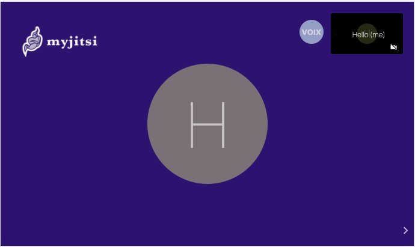

# myjitsi

This Repo is a sample repo, demonstrating a simple way to launch Jitsi meeting display your own logo.

The file you need to modify to add your custom branding is in the file `branding.json`.

You can test the demo by going using [this instance](https://maxired.github.io/myjitsi/) hosted on Github Pages

Once the meeting is launched , you will be able to get the custom color and logo from the branding.json file

# Use my own branding

in order to use your own brading you will need to : 
 - fork this repo
 - activate github page to you new repo
 - update the index.html and 404.html file to update reference from 'https://maxired.github.io/myjitsi/' to you own gh-pages
 - update the branding.json with your settings.
